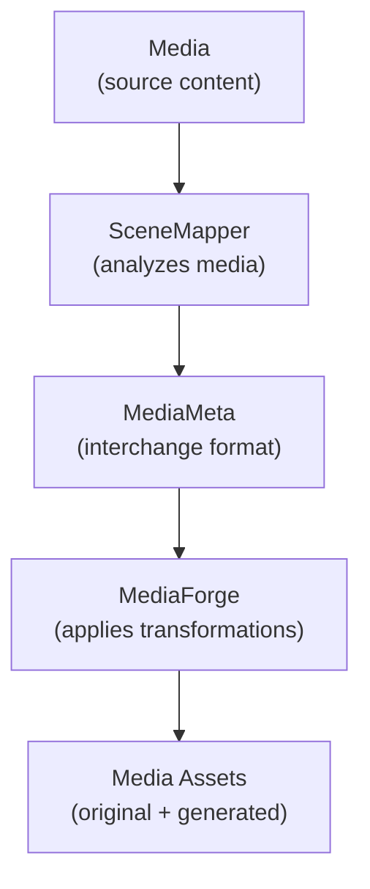

# MediaMeta Specification

Welcome to the **MediaMeta Specification**.

This repository defines the architecture, terminology, and normative specification for the MediaMeta ecosystem.

MediaMeta is an open specification for describing digital media through structured metadata, enabling interoperable analysis, transformation, accessibility, parental controls, content warnings, and future media workflows.

The MediaMeta specification is implementation-independent. Any software may produce or consume MediaMeta documents provided it conforms to the published specification.

---

## Ecosystem Overview

The ecosystem is intentionally divided into distinct responsibilities.

### SceneMapper

Analyzes media and produces MediaMeta documents.

### MediaMeta

Defines the common specification and interchange format.

### MediaForge

Consumes MediaMeta documents to generate transformed media assets.

---

## Repository Contents

This repository contains:

* MediaMeta Specification (MMS)
* JSON Schema
* Architecture documentation
* Design principles
* Terminology and glossary
* Examples
* Governance

This repository intentionally does **not** contain reference implementations.

---

## Design Principles

MediaMeta is built upon a small number of guiding principles:

* Analyze once. Reuse forever.
* Separate observation from policy.
* Preserve original media.
* Generate new assets instead of destructively modifying existing media.
* Remain implementation and container independent.
* Build interoperable tooling through an open specification.

---

## Contributing

The specification evolves through discussion and pull requests.

Architectural proposals, clarifications, examples, and improvements are welcome.

As the project matures, normative changes to the specification will be documented through the MediaMeta Specification (MMS) process.

---

## Website

The published specification is available at:

**https://mediameta.org**

---

MediaMeta is an [**Ohana Commons Project**](https://docs.ohanacommons.org).
